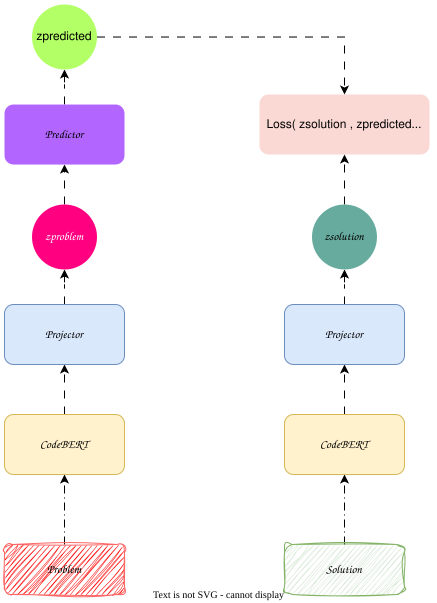

# CodeBEPA

CodeBEPA is an experimental representation learning project that explores
JEPA-inspired learning for source code.

The project investigates whether a model can learn useful representations of
programming problems and their corresponding solutions by predicting latent
representations instead of directly predicting the source code itself.

## Overview

Traditional language-model-based approaches learn representations of code
through token-level prediction. CodeBEPA explores a different direction:
learning in a latent space.

The core idea is to encode a programming problem and its solution into
representations and train a predictor to capture the relationship between
them.

The project currently uses CodeBERT as the code representation backbone and
PyTorch for model training.

## Motivation

Source code contains structural and semantic information that is not always
well represented by token-level objectives alone.

JEPA-style approaches provide an alternative by learning to predict
representations of a target rather than reconstructing the target itself.

For code, this leads to the following question:

> Can a model learn meaningful representations of programming solutions from
> their associated problem descriptions?

CodeBEPA is an experimental attempt to investigate this idea.

## Architecture

The current architecture is centered around a CodeBERT encoder and a
### JEPA-inspired latent prediction objective.



The training objective operates on the learned representations rather than
requiring the model to directly reconstruct the solution source code.

## Dataset

The project uses programming problem and solution data derived from the
Google DeepMind `CodeContests` dataset.

The data is processed into examples containing a programming problem and its
corresponding solution.

The preprocessing pipeline prepares these examples for representation
learning and model training.

Due to limited computational resources, the project focuses on the **Python 3**
subset of the dataset rather than processing the complete collection of
programming languages.


## Masking and Training Objective

CodeBEPA concatenates the programming problem and its corresponding solution
into a single sequence. A second `[CLS]` token is added at the beginning of
the solution so that the model can obtain a separate representation for the
solution.

The resulting structure is approximately:

```text
[CLS1] Problem tokens ... [SEP] [CLS2] Solution tokens ... [SEP]
  │                         │      │
  │                         │      └── Solution representation
  │                         └── Problem/solution separation
  └── Problem representation
```

### Masking

Two masking strategies are used for the different training objectives.

For the `MLM objective`, masking is applied to the concatenated sequence
using a masking probability of `0.15`. The model is trained to recover the
masked tokens.

For the alignment objective, the masking is more structured.

First, the solution tokens are masked. This forces the model to predict the solution representation from
the available context (problem).

The problem is then masked while its [CLS1] token is preserved. The
[CLS1] token is kept because the BERT architecture enforces having a [CLS] at the first position.

### InfoNCE Alignment Loss

The main representation-learning objective uses the **InfoNCE** loss.

The model encodes a programming problem and its corresponding solution. The
predictor uses the problem representation to produce a predicted solution
representation.

The predicted representation should be close to the representation of its
corresponding solution while being distinguishable from the representations
of other solutions in the batch.

For a batch of size $N$, the similarity between the predicted representation
and a solution representation can be written as:

$$
s_{ij} = \operatorname{sim}(z_{\text{pred}}^{(i)}, z_{\text{solution}}^{(j)})
$$

where $i=j$ represents the positive problem-solution pair.

The InfoNCE loss is then:

$$
\mathcal{L}_{InfoNCE}
=
-\frac{1}{N}
\sum_{i=1}^{N}
\log
\frac{
\exp(s_{ii}/\tau)
}{
\sum_{j=1}^{N}\exp(s_{ij}/\tau)
}
$$

where $\tau$ is the temperature parameter.

This encourages the model to align each problem representation with the
representation of its corresponding solution while separating it from
negative solutions within the batch.

The final training objective combines the masked-language-modeling loss with
the InfoNCE alignment loss:

$$
\mathcal{L}
=
\mathcal{L}_{MLM}
+
\lambda\mathcal{L}_{InfoNCE}
$$

where $\lambda$ controls the contribution of the alignment objective.


## Model
### CodeBERT

`CodeBERT` is used as the underlying encoder for source-code representations.

It provides a pretrained representation of programming languages that can
serve as the foundation for the latent-space learning objective.

JEPA-inspired Predictor

The predictor operates in representation space.

Instead of predicting solution tokens directly, the model learns to predict
the latent representation associated with the target solution.

The predictor used in our experiment is simply a linear transformation with : 

$$
z_{\text{pred}} = W z_{\text{problem}}
$$


This makes the project conceptually different from conventional
sequence-to-sequence code generation.

## Training

The model is trained using `PyTorch`.

The current implementation focuses on making the complete training pipeline
work end-to-end, including:

- Dataset preparation
- Input encoding
- Representation extraction
- Latent-space prediction
- Loss computation
- Backpropagation
- Model optimization

Training is currently ongoing, and experiments are being performed locally.

## Current Status

CodeBEPA is currently an ongoing experimental project.

The training pipeline is functional and the model can be trained end-to-end.
Current work focuses on completing training runs and evaluating the learned
representations.

Performance results will be added once the current experiments are
completed.

## Hardware

The project is being developed and trained locally on:

NVIDIA RTX 3050 Ti
4 GB VRAM
16 GB RAM

The relatively limited GPU memory makes training efficiency and memory
management important considerations during experimentation.

- Technology Stack
- Python
- PyTorch
- Hugging Face Transformers
- CodeBERT
- CodeContests
- CUDA

## Project Structure
CodeBEPA/
├── ...
├── ...
└── README.md

The project structure will be documented here as the implementation evolves.


## Dataset Preparation

The CodeBEPA dataset preparation uses the Google DeepMind CodeContests
dataset. Since CodeContests relies on ArrayRecord, Riegeli, Protocol Buffers,
and Bazel, the extraction process is performed inside a Docker container.

### Prerequisites

Install the Google Cloud CLI (`gcloud`) on the host machine.

[Link](https://cloud.google.com/sdk/docs/quickstart)

### 1. Download the dataset

Download the CodeContests dataset using `gcloud` and place it in the project's
`data/` directory:

```bash
gsutil -m cp -r gs://dm-code_contests <YOUR CHOSEN LOCATION>
```

The data consists of ContestProblem protocol buffers in `Riegeli` format.

### 2. Build the dataset-processing environment

Build the Docker image located in [extraction/Dockerfile](./extraction/Dockerfile):

```bash
docker build -t codebepa-dataset_image .
```

### 3. Start the container

Mount the local `dataset location` directory to `/data` inside the container:
```bash
docker run -it --rm `
    -v `DATSET_PATH`:/app/data" `
    codebepa-dataset_image
```

### 4. Copy the extraction script

```bash
docker cp .\extract.py <CONTAINER_ID>:/opt/code_contests/extract.py
```
### 5. access the container 

```bash
docker exec -it <CONTAINER_ID> bash
```
### 6. Modify the bazel version :
The code contest container a deprecated version of Bazel. Therefore in order access the dataset properly we have to change the its version, for our case the decent version is `5.4.1`: 

```bash 
cd /opt/code_contests/
# Change to compatible
echo "5.4.1" > .bazelversion

# Verify if bazel works properly
# Run this command  
bazel build -c opt :print_names_and_sources 
```

### 7. Add the extraction target
The `CodeContests` repository already contains the Bazel configuration required
to generate and use `contest_problem_pb2`, but our `extract.py` script is a
custom addition to the repository.

Therefore, we need to declare it as a Bazel `py_binary` target and explicitly
specify its dependencies. This allows Bazel to build and execute the
extraction script while providing access to the generated
`contest_problem_pb2` module and the Riegeli Python library.

All we need to do is to add it the xtraction target to `BUILD` file .

```bash
cd /opt/code_contests

echo -e "py_binary(\n\tname=\"extract\",\n\tsrcs=[\"extract.py\"],\n\tdeps=[\n\t\":contest_problem_py_pb2\",\n\t\"@com_google_riegeli//python/riegeli\",\n\t],\n)" >> BUILD
```

You must see this section at the end of `BUILD` : 

```python
py_binary(
        name="extract",
        srcs=["extract.py"],
        deps=[
        ":contest_problem_py_pb2",
        "@com_google_riegeli//python/riegeli",
        ],
)
```
### 8. Run the extraction script  : 

Finally, run the extraction target,from the `/opt/code_contests`:

```bash
cd /opt/code_contests

bazel run -c opt :extract -- <INPUT_PATTERN> <OUTPUT_FILE>
```

<INPUT_PATTERN> Could be a file or a regex used by glob
for example  :

```bash
bazel run -c opt :extract -- "/data/raw/code_contests_train.reigli*" "/app/data/codecontests.jsonl"
```

## Data Transformation

After extracting the CodeContests dataset into JSONL, CodeBEPA transforms it
into a smaller dataset suitable for training.

The transformation performs four main steps:

```text
JSONL
  │
  ▼
Keep Python 3 examples
  │
  ▼
Remove incomplete examples
  │
  ▼
Remove duplicates
  │
  ▼
Parquet
```

The script:

- Keeps only PYTHON3 examples.
- Removes examples without a problem description or solution.
- Removes duplicate problem-solution pairs.
- Keeps only the problem and solution fields.
- Processes the data in batches of 10,000 records to limit memory usage.
- Saves the result as multiple Parquet files.
- Running the Transformation

to run the transformation script run 

### Install requirements  :
First ensure that you install all the dependencies needed for tranformation and training  : 

```bash

python -m venv code-jepa-env

# for linux/mac
source code-jepa-env/bin/activate
# for windoes
.\code-jepa-env\Scripts\activate
# install depenencies
pip install requirements.txt
```
### Run transformation Script : 

```bash
python scripts/transform.py \
    --ipath <INPUT_JSONL_PATH> \
    --output <OUTPUT_DIRECTORY>
```
For example:
```bash
python transform.py \
    --ipath data/codecontests.jsonl \
    --output data/parquet
```

The resulting Parquet files are used as the input dataset for `CodeBEPA`
training.

## Running Training process : 

Once the dataset has been transformed into Parquet files, CodeBEPA can be
trained using the provided `train.py` script.

The training configuration is defined in a JSON file located at [src/configs/train.json](./src/configs/train.json):

```json
{
    "model_name": "microsoft/codebert-base",
    "batch_size": 4,
    "accumulation_step": 2,
    "max_length": 256,
    "epochs": 1,
    "learning_rate": 2e-5,
    "alignement_weight": 1.0,
    "device": "cuda",
    "train_dataset": "data/processed/train/cleaned.parquet",
    "val_dataset": "data/processed/valid",
    "hidden_size": 128,
    "output_dim": 128,
    "mlm_probability": 0.15,
    "num_workers": 2,
    "pin_memory": true,
    "save_folder": "hub"
}
```

The configuration specifies the CodeBERT backbone, training parameters,
dataset paths, latent representation dimensions, and hardware settings.

After configuring the file, start training with:

```bash
python train.py
```

The trained model and its checkpoints are saved in the directory specified
by `save_folder`.

# Future Work

Planned directions include:

- Complete the current training experiments
- Evaluate the quality of the learned representations
- Compare different representation-learning objectives
- Investigate downstream tasks for code representations
- Explore more efficient training strategies
- Investigate extensions toward larger predictive models
- Status

Research / Experimental

The project is under active development and should not yet be considered a
finished or production-ready model.

## Author

**Amine Es-Saouiqui**

AI Engineering Student  
ENSA Al Hoceima